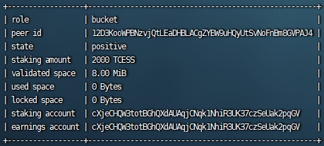

# 服务器要求

存储服务器的推荐要求：

| 资源 | 规格 |
| --- | --- |
| 推荐操作系统 | Linux 64 位英特尔/AMD |
| CPU 核心数 | ≥4 |
| 内存 | ≥8GB |
| 带宽 | ≥5Mbps |
| 公网 IP | 必需 |
| Linux 内核版本 | 5.11 或更高版本 |

# 服务器准备

## 安装 Docker

Docker 安装请参考[官方文档](https://docs.docker.com/engine/install/)。

## 防火墙配置


以下命令均以 root 权限执行。如果出现错误消息 `permission denied`，请切换到 root 权限或在这些命令的开头添加 `sudo`。


默认情况下，节点客户端 **cess-bucket**，使用端口 4001 监听传入连接，如果您的平台阻止该端口 (或在防火墙监控内) ，您需要打开对该端口的访问。

```bash
ufw allow 4001
```

## 磁盘挂载

使用以下命令检查硬盘状态`df -h`：

```bash
$ df -h
```

如果该磁盘并未挂载，则不会在存储挖矿中被使用上。使用以下命令查看硬盘是否已挂载：

```bash
$ fdisk -l

Disk /dev/vdb: 200 GiB, 214748364800 bytes, 419430400 sectors
Units: sectors of 1 * 512 = 512 bytes
Sector size (logical/physical): 512 bytes / 512 bytes
I/O size (minimum/optimal): 512 bytes / 512 bytes
Disklabel type: dos
Disk identifier: 0x331195d1
```

由上述可知，未挂载的磁盘为 `/dev/vdb`。我们将用来 `/dev/vdb` 演示，安装操作如下。

分配 `/dev/vdb` 磁盘：


```bash
fdisk /dev/vdb
Enter and press Enter:
n
p
1
2048
the value after default
w
```

将新划分的磁盘格式化为 `ext4` 格式：

```bash
mkfs.ext4 /dev/vdb
```

如果系统要求进一步输入，请输入 `y` 继续：

```bash
Proceed anyway? (y,N) y
```

创建 `/cess` 目录来挂载磁盘。这里用 `/cess` 目录作为例子：

```bash
mkdir /cess
echo "/dev/vdb /cess ext4 defaults 0 0" >> /etc/fstab
```

将 `/dev/vdb` 替换为您自己的磁盘名称。 命令中的 `/cess` 必须与上一步中创建的相同。如果您没有 root 权限，请尝试：

```bash
echo "/dev/vdb /cess ext4 defaults 0 0" | sudo tee -a /etc/fstab
```

安装 `/cess`：

```bash
mount -a
```

查看磁盘挂载状态：

```bash
df -h
```

如果 `/cess` 出现则说明磁盘挂载成功。

## 准备 CESS 账户

矿工需要创建两个钱包账户。

- **收益账户**：用于获取挖矿奖励。
- **质押账户**：用于质押和签署区块链交易。

请参阅 [CESS 帐户](../community/cess-account.md) 创建 CESS 帐户，然后前往 [CESS 水龙头](https://cess.cloud/faucet.html) 获取测试代币 TCESS，或 [联系我们](../introduction/contact.md) 寻求帮助。

# 安装 CESS 客户端

```bash
wget https://github.com/CESSProject/cess-nodeadm/archive/v0.5.0.tar.gz
tar -xvf v0.5.1.tar.gz
cd cess-nodeadm-0.5.1/
./install.sh
```


检查您使用的是否 [最新版本](https://github.com/CESSProject/cess-nodeadm/tags) 的 `cess-nodeadm`。目前是**v0.5.1**。


如果出现该条消息—— `Install cess nodeadm success`，则表示安装成功。

如果安装失败，请查看 [故障排除步骤](./troubleshooting.md)。

## 配置 CESS 客户端

运行 `cess config set`

```bash
$ cess config set

Enter cess node mode from 'authority/storage/watcher' (current: authority, press enter to skip): storage
Enter external ip for the machine: 173.....213.58
Enter cess bucket income account: cXiHsw32kT3Fzw6YeXDTECCfFNKjDVg85eg......
Enter cess bucket signature phrase: shoe ...... creek metal avoid
Enter cess bucket disk path (default: /opt/cess/storage/disk): /cess
Enter cess bucket space, by GB unit (current: 300, press enter to skip): 1000
Enter the number of CPU cores used for mining; Your CPU cores are 4
  (current: 3, 0 means all cores are used; press enter to skip): 2
Set configurations successfully
```

启动 CESS bucket

```bash
$ cess start

[+] Running 3/0
 ✔ Container chain       Running                                                0.0s
 ✔ Container bucket      Running                                                0.0s
 ✔ Container watchtower  Running                                                0.0s
```

# 常用操作

## 检查 CESS 链同步状态

```bash
docker logs chain
```

如下图所示，如果我们在 [CESS 浏览器](https://testnet.cess.cloud/) 中看到 “best” 对应的区块高度约为最新高度，则说明本地链节点同步完成。


只有链同步完成后，才能操作其他功能，如增加质押、查看节点状态等。

## 查看存储节点日志

```bash
docker logs bucket
```

如下图，看到 `/kldr-testnet` 表示网络环境是测试网络，看到 `Connected to the bootstrap node...` 表示有和 bootstrap 节点的连接。


## 查看存储桶状态

```bash
cess bucket stat
```

返回结果示例如下：



上述名称的进一步解释，请参阅 [术语对照](../glossary.md#storage-miner)。

## 增加质押

```bash
cess bucket increase <deposit amount>
```

## 撤回质押

当您的节点**退出 CESS 网络**（见下文）后，运行以下命令：

```bash
cess bucket withdraw
```

## 查询奖励信息

```bash
cess bucket reward
```

## 领取奖励

```bash
cess bucket claim
```

## 更新所有服务镜像

```bash
cess pullimg
```

## 停止并删除所有服务

```bash
cess down
```

## 更新收入账户

```bash
cess bucket update earnings [earnings account]
```

## 退出 CESS 网络

```bash
cess bucket exit
```

# 升级 CESS 客户端

## 停止并删除所有服务

```bash
cess stop
cess down
```

## 删除所有链数据


除非 CESS 网络已重新部署且确认数据可以清除，否则请勿执行此操作。


```bash
cess purge
```

## 更新 `cess-nodeadm`

```bash
wget https://github.com/CESSProject/cess-nodeadm/archive/<new-version>.tar.gz
tar -xvf <new-version>.tar.gz

cd cess-nodeadm-<new-version>

./install.sh --skip-dep
```

目前 [最新版本](https://github.com/CESSProject/cess-nodeadm/tags)是 **v0.5.1** 。

## 拉取镜像

```bash
cess pullimg
```
